# Retail Sales Big Data Analysis

## Project Overview

This project analyzes retail sales data using Big Data technologies such as Hadoop, MapReduce, Apache Pig, and Apache Hive.

The project demonstrates how retail sales data can be stored, processed, cleaned, and analyzed using the Hadoop ecosystem.

## Technologies Used

* Hadoop
* HDFS
* MapReduce
* Apache Pig
* Apache Hive
* Ubuntu Linux

## Project Workflow

```text
Retail Sales Data
        ↓
       HDFS
        ↓
 Data Processing
        ↓
   MapReduce
        ↓
   Apache Pig
        ↓
   Apache Hive
        ↓
 Sales Analysis
```

## Analysis Performed

* HDFS data storage
* MapReduce processing
* Data cleaning using Pig
* Regional sales analysis
* Monthly sales analysis
* Product-wise analysis
* Revenue analysis
* Hive table operations
* Hive bucketing
* Aggregation using Hive

## Project Screenshots

### 1. MapReduce Output

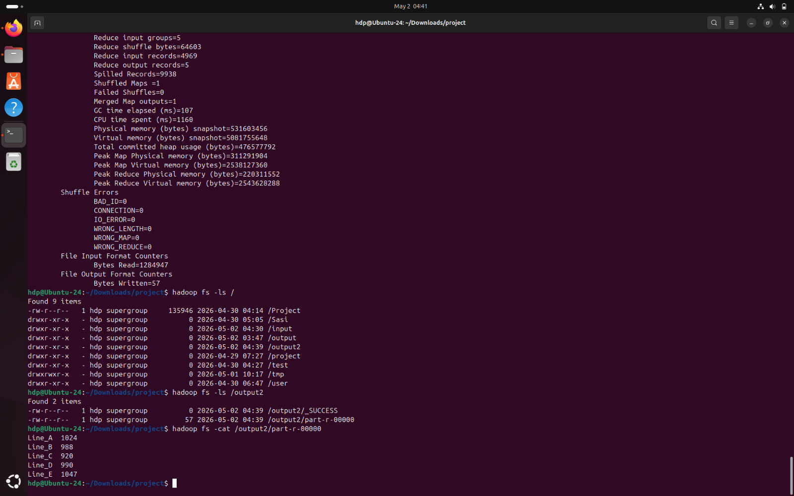

### 2. HDFS Data


### 3. Pig Processing

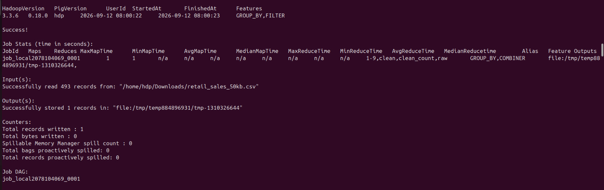

### 4. Regional Analysis

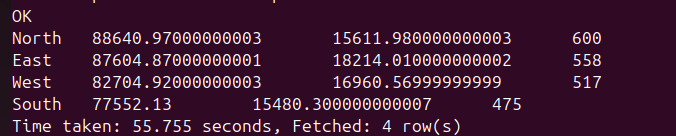

### 5. Monthly Analysis

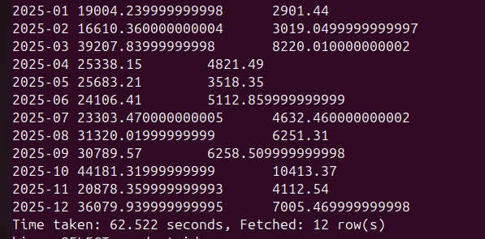

### 6. MapReduce Job

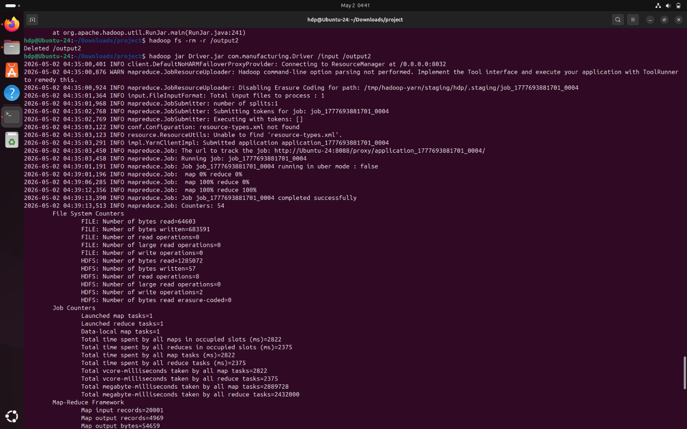

### 7. Hive Table Structure

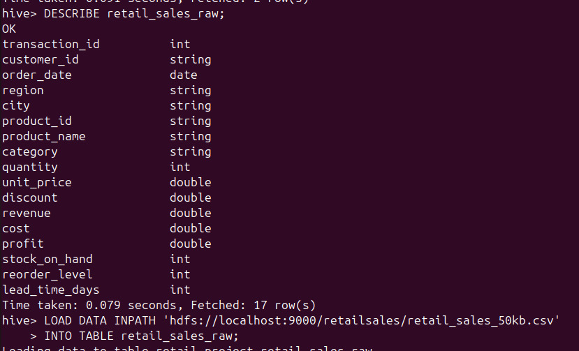

### 8. Record Count

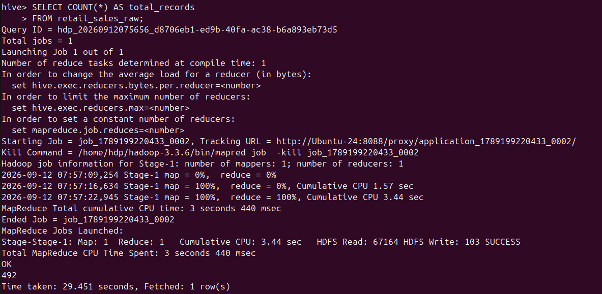

### 9. Cleaned Data

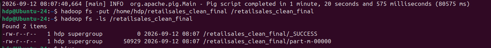

### 10. Product Analysis

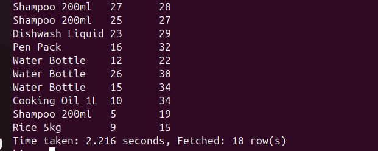

### 11. Product Revenue

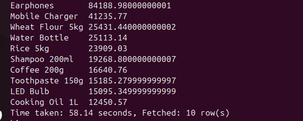

### 12. Available Regions

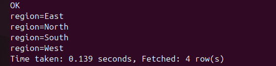

### 13. Hive Bucketing

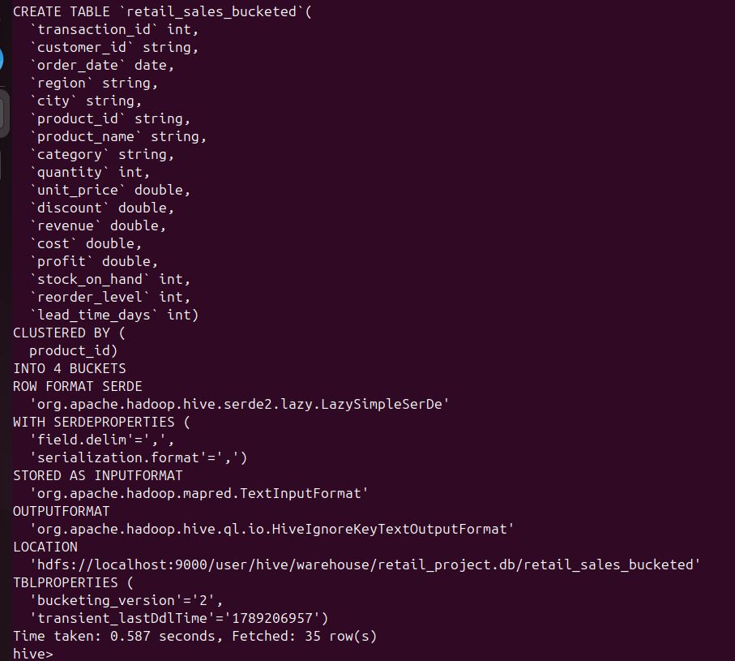

### 14. Regional Revenue


## Conclusion

This project demonstrates the use of Hadoop, MapReduce, Apache Pig, and Apache Hive for processing and analyzing retail sales data using Big Data technologies.
